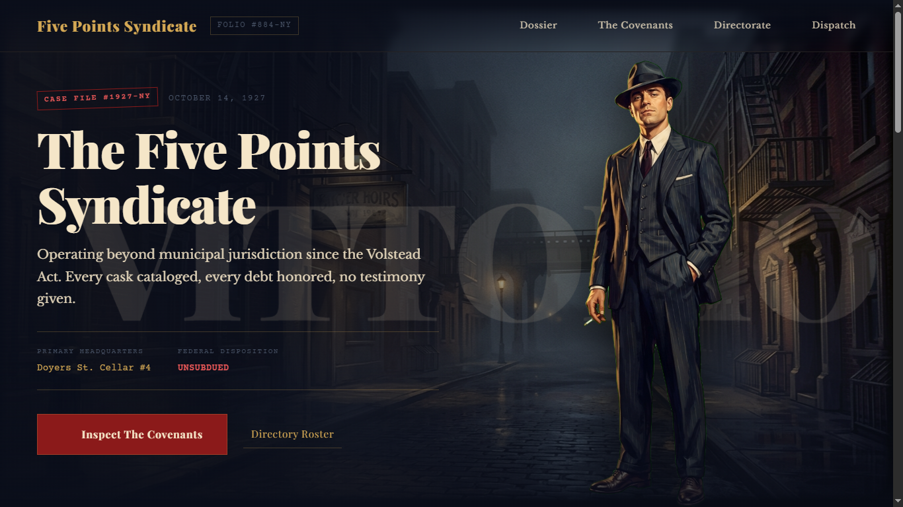
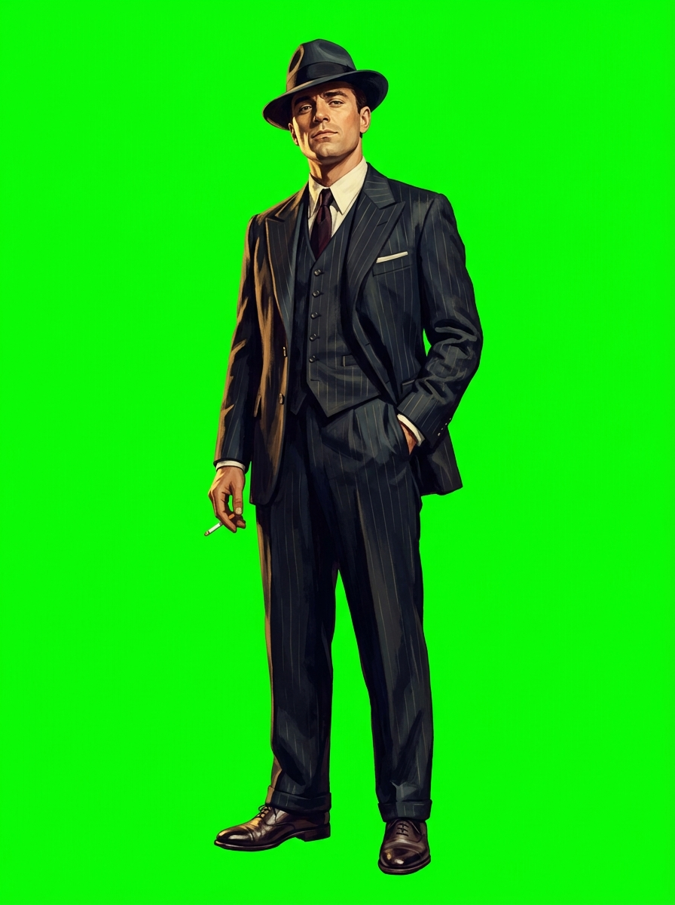
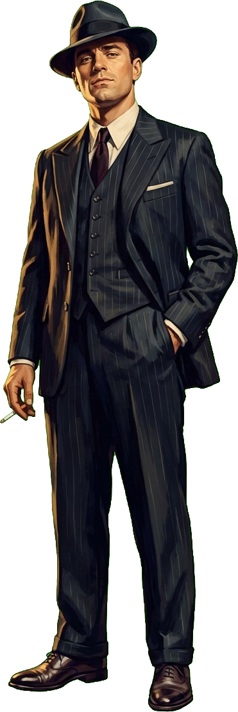

# 🎭 Diorama — Layer-Composited Anti-Slop UI

<p align="center">
  
</p>

<p align="center">
  <strong>Turn AI coding agents into senior graphic designers. Stop generating flat billboards and cookie-cutter SaaS templates.</strong>
</p>

<p align="center">
  <a href="https://github.com/ImpactG1/Diorama/stargazers"></a>
  <a href="https://github.com/ImpactG1/Diorama/blob/main/LICENSE"></a>
  <a href="https://github.com/ImpactG1/Diorama/actions"></a>
  <a href="https://python.org"></a>
  <a href="#-quickstart--agent-installation"></a>
</p>

<p align="center">
  <a href="https://impactg1.github.io/Diorama/"><strong>🌐 [ Live Interactive Demo ]</strong></a> &nbsp;•&nbsp;
  <a href="#-the-diorama-anatomy"><strong>🏗️ Architecture</strong></a> &nbsp;•&nbsp;
  <a href="#-true-alpha-recovery-pipeline-no-painted-checkerboards"><strong>🧪 Alpha Pipeline</strong></a> &nbsp;•&nbsp;
  <a href="#-the-anti-slop-linter-lint_anti_sloppy"><strong>🚨 Anti-Slop Linter</strong></a> &nbsp;•&nbsp;
  <a href="#-quickstart--agent-installation"><strong>⚡ Quickstart</strong></a>
</p>

---

## ⚡ The Crisis: Modern AI UI is Drowning in "Slop"

Ask any modern image model or coding agent (Claude Code, Cursor, GPT-4, Antigravity) to design a *"1920s Mafia Landing Page"* or a *"Cyberpunk Terminal"*, and you inevitably get one of two catastrophic failure modes:

1. **The Hallucinated Flat Billboard**: The agent prompts an image model for "a landing page" and pastes the single flat JPEG into a `<div>`. The text is misspelled gibberish baked into pixels, buttons cannot be clicked, it's non-responsive, and unmaintainable.
2. **The Generic SaaS Card Trap**: The agent defaults to the same cream-and-terracotta card template, centered layout ("The Centering Disease"), Lucide stock icons, and AI copywriting tricolons: *"Power. Loyalty. Respect."*

Neither is a real user interface.

**Diorama completely solves this.** 

Diorama is an agent skill, architectural methodology, and toolset that decomposes scenes into independent transparent layers, derives true mathematical alpha transparency (defeating the model's painted checkerboard), interleaves live DOM typography in depth, and enforces strict anti-slop graphic design principles.

---

## ✨ The Diorama Anatomy

Instead of one flat image or a generic flexbox card grid, Diorama builds a real, living stage:

```
[ z-index: 50 ]  Front Interactive UI (Asymmetric 12-col grid, docket stamps, ledger CTAs)
[ z-index: 45 ]  Marginalia & Surveillance Spine Log
[ z-index: 41 ]  35mm Film Grain (mix-blend-mode: overlay)
[ z-index: 40 ]  Atmospheric Smoke Drift (mix-blend-mode: screen)
[ z-index: 30 ]  Foreground Props (whiskey glasses, spent cartridges, bottom framing)
[ z-index: 20 ]  Hero Character Cutout (True Alpha PNG, anchored stage-right)
[ z-index: 15 ]  INTERLEAVED BACK MASTHEAD ("VITTORIO" watermark BEHIND character)
[ z-index: 10 ]  Midground Props (Model T sedan, gas lamp post)
[ z-index: 5  ]  Directional Atmospheric Scrim (linear-gradient contrast shield)
[ z-index: 0  ]  Base Background Plate (Cobblestone street, deep fog, no characters)
```

### The Magic: True Depth Interleaving
Notice that the giant editorial masthead (`VITTORIO`) sits at `z:15` **behind** Don Vittorio (`z:20`), while the surveillance dossier copy sits at `z:50` **in front**. The text is 100% accessible HTML, fully selectable, responsive, and SEO-indexed.

---

## 🔬 True Alpha Recovery Pipeline (No Painted Checkerboards)

Image models cannot output real alpha channels. If you prompt for "transparent background", they literally paint a grey-and-white checkerboard.

Diorama solves this with a zero-dependency, cross-platform chroma-keying engine:

<p align="center">
  
  &nbsp;&nbsp;➔&nbsp;&nbsp;
  
</p>

1. **Render subject on `#00FF00`** with the Art Bible Lock Block.
2. **Execute Chroma Key**:
   ```bash
   python scripts/chroma_key.py raw-character.jpg hero-character.png --key-color "#00FF00" --similarity 0.22 --blend 0.08
   ```
3. **Verify True Alpha Channel**:
   ```bash
   python scripts/verify_alpha.py hero-character.png
   # Output: [PASS] hero-character.png: 42.6% transparent, 56.9% opaque. Safe to composite.
   ```

---

## 🚨 The Anti-Slop Linter (`lint_anti_slop.py`)

Diorama includes an automated static linter that audits HTML and CSS to ruthlessly detect and fail AI design reflexes before your page ships:

```bash
python scripts/lint_anti_slop.py examples/mafia-landing/
```

```text
============================================================
  DIORAMA ANTI-SLOP LAYOUT & TYPOGRAPHY LINTER
============================================================

 [PASS] No layout, centering, or copywriting anti-slop tells found!
  - Asymmetric grid or depth interleaving present.
  - Atmospheric scrims / proper contrast verified.
  - Clean in-world copy and motion safety respected.
```

### What the linter catches:
* ❌ **The Centering Disease**: Penalizes pages with >40% `text-align: center`. Enforces asymmetric 12-column editorial grids.
* ❌ **Muddy Text Shadows**: Flags amateur `text-shadow: 0 0 20px #000` hacks used to fix contrast over painted art. Enforces directional gradient scrims.
* ❌ **AI Copywriting Tropes**: Automatically flags *"Every empire starts with..."*, *"Where tradition meets..."*, *"Power. Loyalty. Respect."*, and generic *"Get Started"* CTAs.
* ❌ **Motion Sickness**: Requires `@media (prefers-reduced-motion: reduce)` kill-switches.

---

## 🚀 Quickstart & Agent Installation

Diorama works out of the box with all leading AI agent environments.

### 1. Antigravity / Gemini CLI
Clone or symlink into your global or workspace skills directory:
```bash
# Global
git clone https://github.com/ImpactG1/Diorama.git ~/.gemini/config/skills/diorama

# Or workspace-scoped
git clone https://github.com/ImpactG1/Diorama.git .agents/skills/diorama
```

### 2. Claude Code
Add Diorama to your project skills:
```bash
git clone https://github.com/ImpactG1/Diorama.git .claude/skills/diorama
```
Or reference `SKILL.md` directly in your prompt:
> *"Use the Diorama methodology in .claude/skills/diorama/SKILL.md to build a 1920s noir speakeasy landing page."*

### 3. Cursor & Windsurf
Add Diorama as a workspace rule:
```bash
mkdir -p .cursor/rules
cp references/anti-slop-checklist.md .cursor/rules/diorama.mdc
```

### 4. Standalone CLI Usage (Python)
Only requires `Pillow`:
```bash
pip install Pillow

# Key an asset
python scripts/chroma_key.py input.png output.png --key-color "#00FF00"

# Verify all assets in a folder
python scripts/verify_alpha.py assets/

# Lint your HTML/CSS
python scripts/lint_anti_slop.py index.html styles.css
```

---

## 📂 Repository Structure

```text
.
├── SKILL.md                          # The core Agent Skill prompt & workflow
├── assets/                           # High-res visual previews and demonstration assets
├── scripts/
│   ├── chroma_key.py                 # Cross-platform pure-Python chroma keying & despill
│   ├── verify_alpha.py               # Batch PNG alpha transparency auditor
│   ├── lint_anti_slop.py             # Static HTML/CSS anti-slop layout & copy linter
│   └── chroma_key.sh                 # Linux/macOS ffmpeg + ImageMagick pipeline
├── references/
│   ├── anti-slop-checklist.md        # The manual inspection checklist
│   ├── spatial-layouts.md            # 12-column grid archetypes & depth interleaving
│   ├── composition-patterns.md       # HTML/CSS code patterns, blend modes & scrims
│   ├── animation-playbook.md         # Motion rules (One orchestrated moment per scene)
│   └── prompt-patterns.md            # Structured prompts for each depth layer
└── examples/
    └── mafia-landing/                # Complete reference implementation
        ├── art-bible.md              # Palette, lighting rule, typography, copy persona
        ├── manifest.md               # Full z-index layer component manifest
        ├── prompts/                  # Layer-by-layer generation prompts
        ├── index.html                # Asymmetric depth-interleaved markup
        ├── styles.css                # Production CSS with responsive reflow
        ├── background-plate.jpg      # Rendered 1927 noir street plate
        └── hero-character.png        # Chroma-keyed alpha cutout of Don Vittorio
```

---

## 🎯 The 7-Step Anti-Slop Method

1. **Step 0 — Lock the Art Bible**: Research real historical/thematic details. Lock 4–6 hex colors, a 1-sentence lighting rule (*"Warm tungsten key light from screen-left..."*), a render medium, and 3-tier font stack.
2. **Step 1 — Component Manifest**: Decompose scene into 6–8 distinct layers across z-index planes (background, masthead, hero cutout, scrims, textures).
3. **Step 2 — Prompt on `#00FF00`**: Generate each layer separately on green screen. Background plate is rendered empty of people.
4. **Step 3 — Key & Verify Alpha**: Run `chroma_key.py` and enforce `verify_alpha.py`.
5. **Step 4 — Composite in DOM**: Implement asymmetric 12-column grid. Interleave display typography behind cutout. Apply directional scrims.
6. **Step 5 — One Motion Moment**: Exactly one motion highlight (entrance stagger, parallax, or ambient drift). Never animate everything.
7. **Step 6 — Lint & Ship**: Run `lint_anti_slop.py` and apply the *"remove one accessory"* rule.

---

## 🤝 Contributing

We welcome contributions! If you have built a new Diorama archetype (e.g. *Cyberpunk Dossier*, *Industrial Blueprint*, *Vintage Botanical*), or improved keying algorithms:

1. Fork the Project
2. Create your Feature Branch (`git checkout -b feature/NewArchetype`)
3. Commit your Changes (`git commit -m 'feat: Add Cyberpunk Dossier archetype'`)
4. Push to the Branch (`git push origin feature/NewArchetype`)
5. Open a Pull Request

---

## 📜 License

Distributed under the **MIT License**. See [`LICENSE`](LICENSE) for more information.

---

<p align="center">
  Built with dedication to craftsmanship by <a href="https://github.com/ImpactG1">ImpactG1</a>.
  <br>
  <strong>If Diorama inspired you, please consider giving it a ⭐!</strong>
</p>
